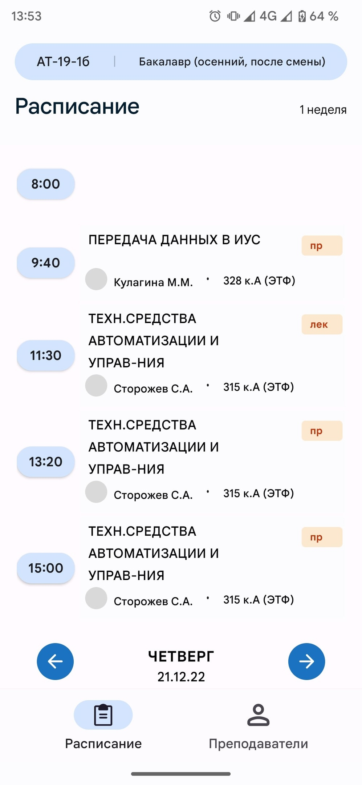
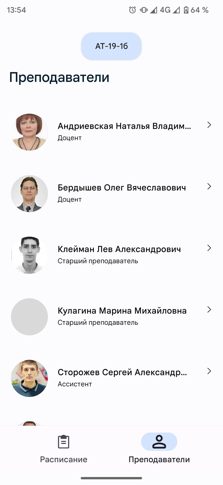
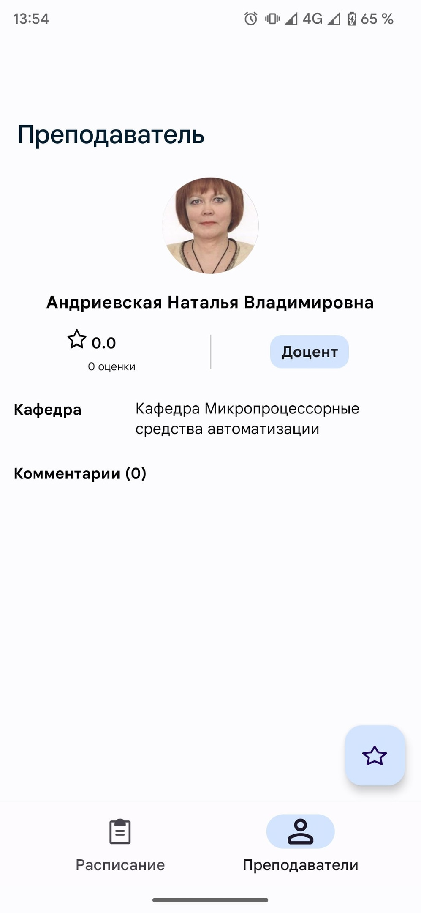

# TimeTableApp
## Состав группы
| №  | ФИО                        | Группа    | 21.12.2022 |
|----|----------------------------|-----------|------------|
| 1  | Шеретов Марк Алексеевич    | АСУ-19-1б |  Зачтено   |
| 2  | Ушаков Андрей Сергеевич    | РИС-19-1б |            |
| 3  | Зиятдинов Расиль Артурович | АСУ-19-1б |            |
| 4  | Неволин Сергей Дмитриевич  | АСУ-19-1б |            |

## Описание

Технические характеристики Android приложения для студентов ПНИПУ

#### 1. Общий обзор
Это приложение предоставляет студентам простой способ получения расписания и информации о преподавателях

#### 2. Особенности
* Выбор расписания по названию группы.
* Оценка преподавателей и написание комментариев.
* Просмотр профилей преподавателей.

#### 3. Дизайн пользовательского интерфейса
Пользовательский интерфейс приложения создан интуитивно понятным и удобным для пользователя, чтобы пользователи могли легко перемещаться по нему без какой-либо путаницы. Прототип дизайна приложения был разработан в Figma [(прототип)](https://www.figma.com/proto/y3ZKCCElI1NMYFSQaoAVuK/timetable_app?page-id=0%3A1&node-id=2%3A4&viewport=-470%2C567%2C0.82&scaling=scale-down&starting-point-node-id=2%3A4&show-proto-sidebar=1) в стиле Material 3

#### 4. Технические требования
* Приложение должно быть разработано с использованием Android Studio и Java в качестве основного языка программирования
* Приложение должно поддерживать устройства под управлением Android версии 5 (Lollipop) или выше, чтобы обеспечить совместимость с широким спектром устройств
* Приложение должно быть оптимизировано как для телефонов, так и для планшетов, чтобы обеспечить бесперебойную работу на всех типах устройств
* Должны быть разработаны дополнительные сервисы (backend, парсеры) для обеспечения работоспособности приложения

#### 5. Функциональные требования
* Должна быть представлена возможность выбора даты, группы и типа расписания
* Информация о предмете должна содержать название предмета, тип (лек, прак, ...), преподавателя и место проведения занятия
* Выбор группы должен содержать поиск по названию
* Список преподавателей должен выдаваться для каждой группы отдельно
* На странице преподавателя должна быть представлена его средняя оценка, список комментариев и кнопка для оценивания, которая открывает форму для заполнения

## Дополнительные сервисы
1. [Парсер преподавателей](https://github.com/leenzstra/timetable_teacher_parser)
2. [Парсер расписания](https://github.com/leenzstra/timetable_parser)
3. [Сервер (REST API)](https://github.com/leenzstra/timetable_server)

## Скриншоты приложения

<table>
  <tr>
     <td>Экран расписания</td>
     <td>Экран преподавателей группы</td>
     <td>Экран информации о преподавателе</td>
  </tr>
  <tr>
    <td></td>
    <td></td>
    <td></td>
  </tr>
 </table>
